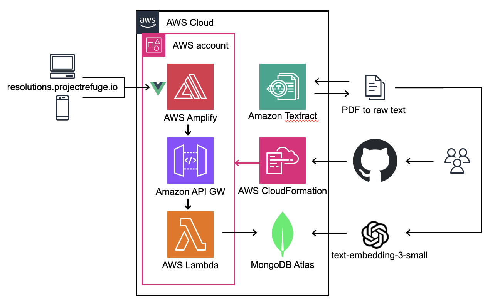

# resolutions-search-template

## A Live, Accessible, and Scalable Search Platform
This project provides a blueprint for a single-page application (SPA) designed to facilitate fast, scalable, and accurate semantic search for UN General Assembly resolutions, Security Council resolutions, and Presidential statements. The solution integrates a Vue.js frontend, a serverless AWS Lambda/API Gateway backend, and a preconfigured MongoDB Atlas cluster to enable users to perform natural language queries with instant results.

## Solution Overview
1. Text Extraction and Structuring
Raw text was extracted from resolution PDFs using Amazon Textract.
A custom Go script parsed and segmented these documents into individual resolutions using Regex. (link to the script when publicly available).
The structured data was made searchable by converting decades of resolutions into query-ready formats.
2. Search-Ready Database
Resolutions were stored in MongoDB Atlas, optimized for semantic search.
An [adapted Node.js script](https://www.mongodb.com/docs/atlas/atlas-vector-search/create-embeddings/) processed and uploaded the data as 1,536-dimension vector embeddings.
3. User-Friendly Interface
Built with Vue.js, the frontend provides a simple, intuitive interface.
Users can type natural language queries (e.g., “respect for humanitarian law”) and receive precise results instantly.
4. Scalable Backend on AWS
Backend services leverage AWS Lambda and API Gateway for scalability and cost efficiency.
The entire application is hosted as a subdomain for seamless accessibility.
5. Collaboration and Open Source
The project is designed as a blueprint for others.
In collaboration with the ICRC, the solution is being prepared for release as open-source under their Open Source Program Office (OSPO).
Usage

### Architecture


## Prerequisites

1. **MongoDB Atlas Cluster**: Ensure you have a MongoDB Atlas cluster set up. You can create one [here](https://www.mongodb.com/cloud/atlas). See [this repository](https://github.com/projectrefuge/resolutions-data-engr-sample) for a sample script and docs to upload data to MongoDB Atlas.

2. **AWS Account**: You need an AWS account to access AWS services.

3. **Node.js**: Make sure you have Node.js installed. You can download it from [here](https://nodejs.org/).

4. **AWS CLI**: Install the AWS CLI to interact with AWS services from your terminal. You can install it from [here](https://aws.amazon.com/cli/).

5. **Git**: Ensure you have Git installed to clone the repository. You can download it from [here](https://git-scm.com/).

6. **Personal Access Token (PAT)**: Generate a Personal Access Token (PAT) with fine-grained permissions for your GitHub organization. Optionally, test access to ensure the token works:

    ```bash
    curl -H "Authorization: token <your_github_pat>" https://api.github.com/repos/[your-org]/[your-repository]
    ```

7. **Environment Variables**: Set up the necessary environment variables for your application, such as MongoDB connection string and AWS credentials.

## Usage

### AWS Initial Setup

1. **Create an S3 Bucket**: Create an S3 bucket to store your Lambda function code.

2. **Update Lambda Code**: Update the Lambda code in the `function` directory to include your MongoDB connection string. Then, zip the contents and upload it to the S3 bucket with the path `lambda.zip`. (A skeleton shell script is provided in the root directory to help with this process.)

3. **Create SSM Parameter**: Create an SSM parameter for the GitHub PAT created in the prerequisites section.

### Deploy the CloudFormation Stack

1. **Create a New Stack**: Go to the CloudFormation console and create a new stack using the `cfn-init.yml` template file in the `init` directory.

2. **Add Stack Name and Parameters**: Add a stack name and populate the parameters with the resource names you created in the AWS steps above.

3. **Deploy the Stack**: Deploy the stack with default settings.

### Configure Application Repository

1. **Reconnect Repository**: In AWS Amplify, go to the app's settings under Branch Settings, click `Reconnect Repository`.

2. **Configure GitHub App**: Click `Configure GitHub App` and authorize the app to access your repository.

3. **Set Production Branch**: Set the `main` branch as the production branch in AWS Amplify. To deploy, navigate to the Overview tab, select your production branch, and run job. This will deploy your app, and future pushes to the main branch will automatically trigger new deployments.

4. **Optional: Set up a custom domain**: To set up a custom domain, follow the instructions in the [AWS Amplify documentation](https://docs.aws.amazon.com/amplify/latest/userguide/amplify-console-custom-domains.html).

5. **Optional: Add branch**: To add a branch, navigate to the App's Branches tab, click `Add Branch` and select the branch you want to add. This will create a staging area with new subdomain to screen changes to the main the branch.

## Features
Natural Language Search: Query decades of resolutions instantly using semantic search.
Scalable Infrastructure: Built on AWS Lambda for cost-effectiveness and high availability.
Open Source Blueprint: Enable other organizations to adapt and reuse the tool.

## License
This project is licensed under the Apache License 2.0.